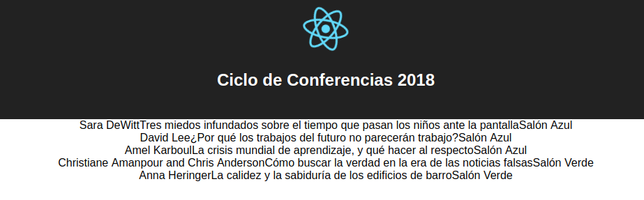
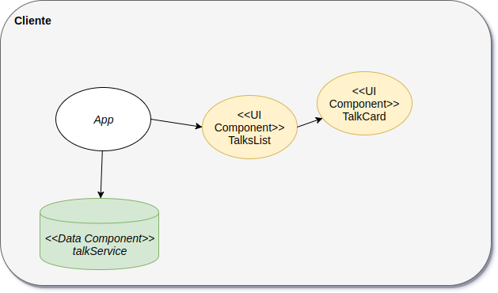

# Curso Full Stack Developer

## Entorno de trabajo

Para instalar el entorno de trabajo recomendamos usar

- Git
- Git Bash (en Windows) o cualquier Git client
- Node JS
- Visual Studio Code

Te dejamos [una guía de instalación paso a paso](http://wiki.uqbar.org/wiki/articles/instalacion-de-entorno-javascript.html)

## Crear un proyecto React

Para crear un proyecto React tenemos un [script que resuelve las dependencias y la configuración por defecto](https://github.com/facebookincubator/create-react-app).

```bash
$ npm install -g create-react-app
$ create-react-app xxxxxx // xxxxxx es el nombre de nuestro proyecto
```

## Primera iteración

Esta es la primera iteración. Permite mostrar una lista (fea) de conferencias a una charla. Tiene los siguientes componentes

- **TalksService**: es un servicio que devuelve una lista de charlas hardcodeadas en formato JSON. No existe la charla como objeto sino que es un mapa de atributos y valores.
- **ListView**: es nuestro componente que muestra la lista de charlas, por el momento de un modo muy tosco.
- **TalkCard**: un componente que sabe mostrar una charla.

## Demo



## Diagrama de la arquitectura




