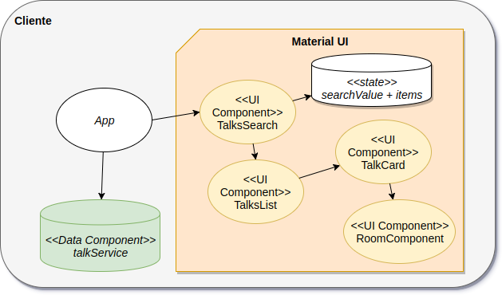

# Curso Full Stack Developer

## Tercera iteración: Props vs. State

En esta iteración ingresamos un filtro de búsqueda. De esa manera debemos diferenciar

- **props** o properties, que utilizamos para pasar información entre componentes
- **state**, el estado que cada vez que se modifica regenera los componentes relacionados

> En nuestro caso tenemos como state el valor de la búsqueda ingresada y las charlas encontradas con ese criterio. El evento onChange del texto dispara el cambio del estado, lo que hace refrescar la lista. Esto ocurre en un nuevo componente **TalksSearch**. La información que le pasa al componente TalksList (que genera la lista de charlas) se hace por medio de propiedades.

## Demo

## Diagrama de la arquitectura

