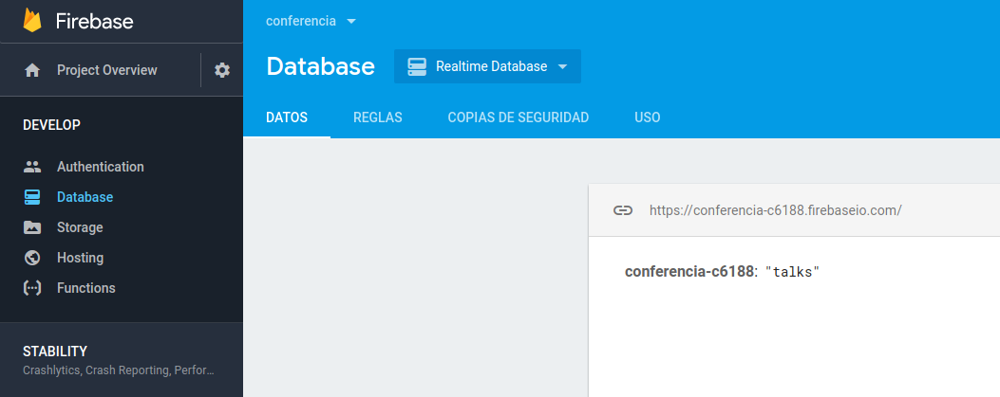
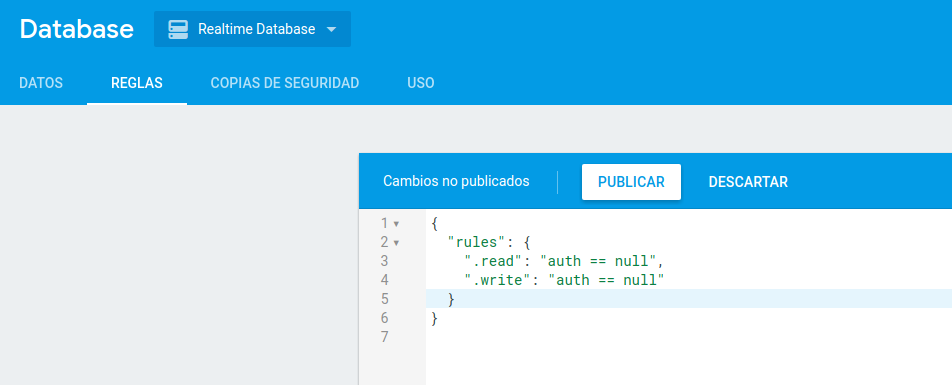
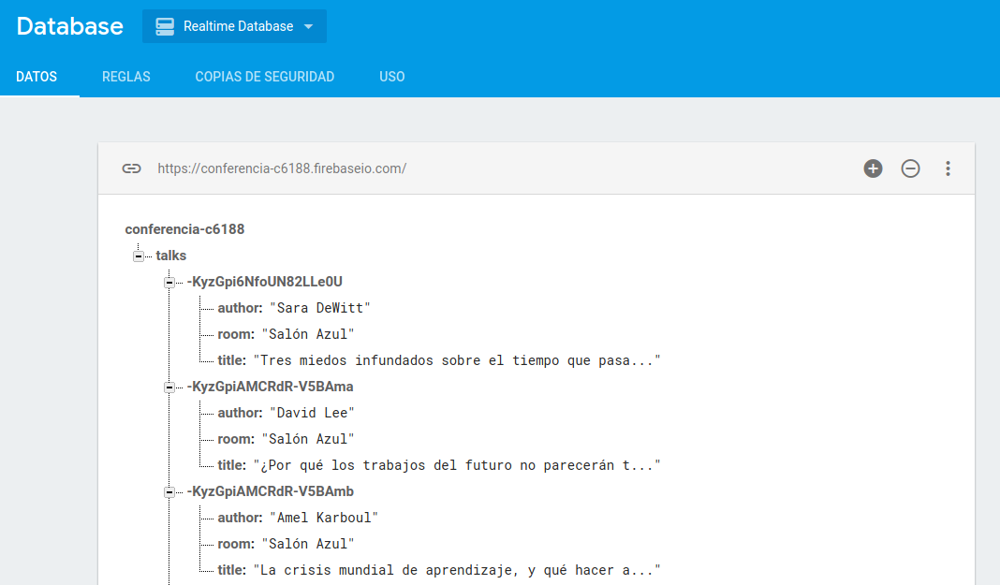
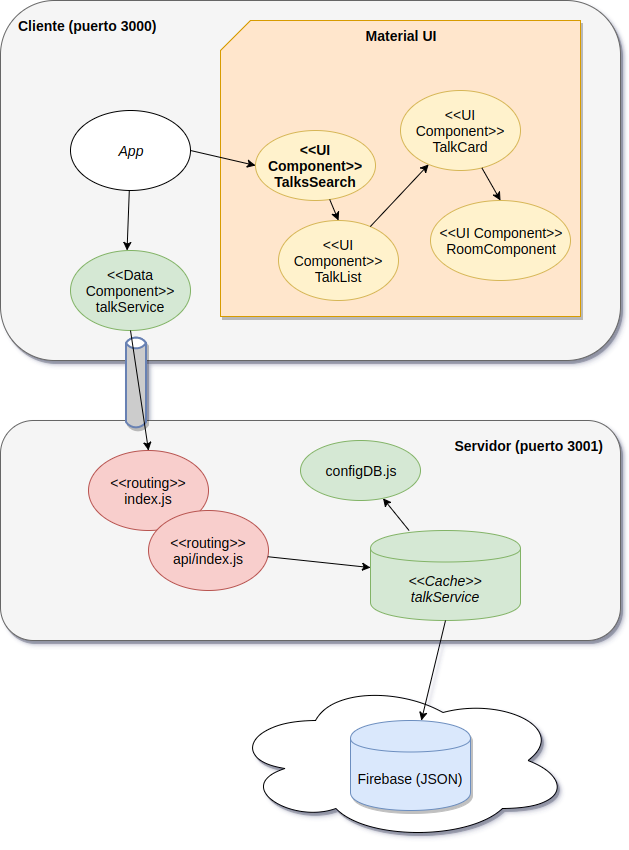

# Curso Full Stack Developer

## Sexta iteración: persistencia con Firebase

Hasta el momento nuestra aplicación no tiene persistencia: cada vez que levantamos el servidor NodeJS se crean los datos de las charlas y al detenerse el servidor se destruyen los objetos que están en la memoria de nuestro application server. Vamos a agregarle ahora a las charlas la propiedad de persistirse en un esquema de base de datos, en principio en la nube, a través del servicio **Firebase**.

## Configuración de Firebase

Con nuestra cuenta de google, debemos configurar la consola ingresando a:

https://console.firebase.google.com/

y generando un proyecto.

[Este video](https://www.youtube.com/watch?v=-khvgXEq09w&feature=youtu.be) cuenta en detalle cómo configurar y utilizar la consola de Firebase además de generar un componente desde NodeJS para acceder a dicha información.

## Configuración de la consola

En Database, Datos creamos dentro del proyecto la colección "talks":



## Autenticación desactivada (solo para empezar a jugar)

Inicialmente en la solapa Reglas vamos a desactivar el login requerido para poder guardar o recolectar información:



> Por supuesto que desaconsejamos esta configuración, pero para comenzar nos permitirá concentrarnos en generar la información correctamente.

## Configuración del proyecto server

Agregamos la dependencia a Firebase en el proyecto server.

```bash
npm install firebase --save
```

## Carga de datos iniciales

Para cargar la información generamos un archivo js y lo invocamos en la consola:

```bash
npm run -s build
node dist/services/initData
```

TODO: Ver por qué no libera el control



## Cache de las charlas

Si asumimos que la cantidad de charlas que vamos a tener no superará las 100.000 por el momento, podemos mantener una [cache](https://es.wikipedia.org/wiki/Cach%C3%A9_(inform%C3%A1tica)) o buffer en la memoria de NodeJS y tenerla sincronizada con Firebase. De esa manera cuando levante la aplicación tenemos que definir que esa cache (compuesta por una lista de JSONs) se asocia al valor que tendrá la colección "talks" en nuestra base de datos en tiempo real que definimos en Firebase.

Esta es la nueva responsabilidad de TalkService que también podríamos llamar TalkRepo o TalkHome, como el lugar donde voy a buscar las charlas en el servidor.

```javascript
export default class TalksService {
    
        constructor() {
            this.talks = []
            this.db = db.collection("talks")
            this.db.on("value", snap => {
                this.talks = []
                snap.forEach(snapTalk => {
                    const newTalk = { id: snapTalk.key }
                    const talk = snapTalk.val()
                    newTalk.author = talk.author
                    newTalk.title = talk.title
                    newTalk.room = talk.room
                    this.talks.push(newTalk)
                })
            })
        }

    ...
```

Periódicamente, la aplicación de Node busca la información de la colección "talks" y la sincroniza. Por el momento, sabemos que no hay escrituras, entonces nos alcanza con una estrategia muy básica 

Fíjense que hasta el momento venimos manejando las charlas como un simple JSON, sin comportamiento. Esto es simple y cómodo, aunque ya empieza a costarnos líneas en el service, que debe desagregar la información que recibe para construir el objeto charla que va a estar en la cache.

La cache además permite mantener la búsqueda por título o autor, algo que [Firebase no trae ya que está pensado para hacer consultas rápidas por clave](https://firebase.google.com/docs/database/admin/retrieve-data?hl=es-419). 

## Diagrama de arquitectura



En el lado cliente no hay cambios. Del lado del server tenemos algunos cambios: 

- configDB nos permite conectarnos contra la base Firebase y devuelve la referencia a la instancia de la colección talks. 
- la inicialización de los datos se hace en un archivo aparte (_initData.js_) cuya explicación se hizo más arriba
- y por último talkService mantiene una cache así como la sincronización de los datos con Firebase.

## Demo

En la demo vemos cómo responde la aplicación cuando la URL cambió (error 404: Not Found) el server está caído (error 500: Internal Server Error)


