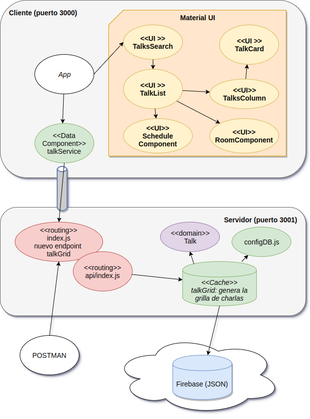

# Curso Full Stack Developer

## Décima iteración: grilla de horarios - Parte III

En esta oportunidad vamos a mejorar el look & feel del lado del cliente, para lo cual tenemos que reestructurar nuestro front-end. Ya no podemos mostrar una lista de elementos, sino que tendremos una Table, o grilla con las charlas. Como hemos contado anteriormente:

- el encabezado de las columnas se genera en base a la lista _rooms_ que viene dentro del json que el servicio REST devuelve
- cada fila se forma con una primera línea de encabezado: _schedule_ dentro de _scheduleDTO_, y luego tenemos n columnas adicionales que se forma en base a la lista de charlas (_talks_ dentro de _scheduleDTO_). Hay que permitir que haya valores no definidos en la lista (huecos) para dejar en blanco esa posición en la grilla.

## Nueva jerarquía de componentes en ReactJS

La nueva jerarquía propuesta es:

* **TalkSearch (modificado)**: guarda en el estado el valor a buscar, el mensaje de error y el grilla con los resultados
    - ErrorMessage: muestra el mensaje de error por un tiempo
    - **TalkList (modificado)**: arma la tabla
        - **RoomComponent (nuevo)**: sabe mostrar una sala, aprovechando el color definido para cada sala
        - **ScheduleComponent (nuevo)**: sabe mostrar el horario, con un ícono descriptivo y el rango horario previsto
        - **TalksColumn (nuevo)**: sabe mostrar la lista de charlas, tantas como vengan en _scheduleDTO.talks_. Delega a TalkCard
            - **TalkCard (modificado)**: sabe mostrar una charla, ahora no con un Card, sino con un Paper con borde redondeado y una Toolbar.

## Correcciones

En versiones anteriores TalkCard estaba haciendo esto:

```javascript
export class TalkCard extends Component {
    componentWillMount() {
        this.talk = this.props.talk
    }

    render() {
        return (
            <Card>
                <CardTitle title={ this.talk.title } subtitle={ this.talk.author }/>...
        )
    }
}
``` 

Esto no era bueno, ya que el evento componentWillMount() solo se ejecuta cuando React detecta que debe ejecutarse:


Si TalkCard renderiza todo en base a la referencia que tiene al objeto talk, y esa referencia no cambia, es un tema porque el método componentWillMount() no se va a ejecutar y la grilla **no se actualiza** por más que busquemos diferentes cosas (solo funciona la primera vez).

Hay que tener cuidado con esto:

- el estado debería ser siempre inmutable (ojo con las colecciones a las que le hacemos push en lugar de concat, queremos concat que devuelve una nueva colección y no push que mantiene la misma colección y por lo tanto no genera un nuevo estado ni un render que es lo que necesitamos)
- hay que conocer el ciclo de vida de ReactJS para evitar sorpresas desagradables (como estar revisando este error a las 2 de la mañana de un viernes, cualquier parecido con la realidad no es mera coincidencia) 

Para más información pueden leer [este artículo](https://www.codevoila.com/post/57/reactjs-tutorial-react-component-lifecycle).

## Demo de esta iteración

Vemos cómo queda la aplicación en ReactJS:


## Diagrama de arquitectura




