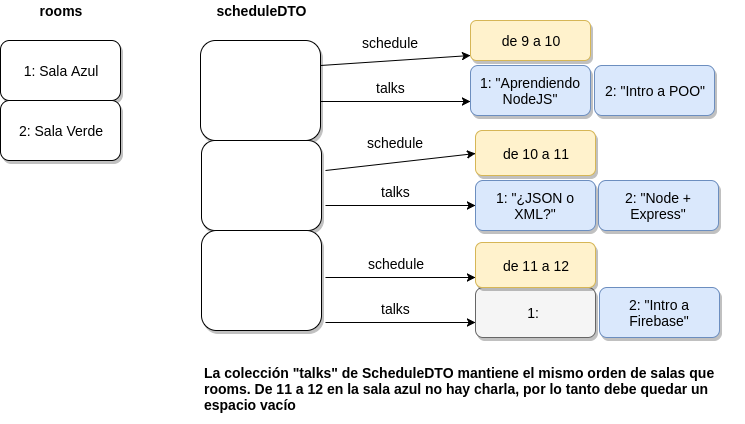
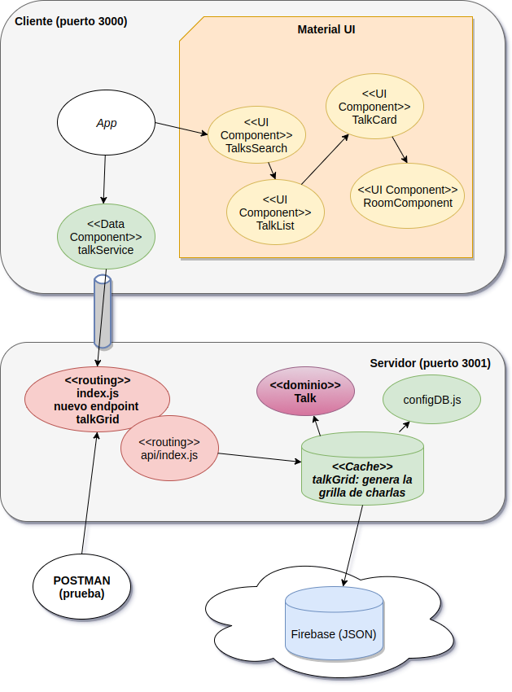

# Curso Full Stack Developer

## Novena iteración: grilla de horarios - Parte II

## Nuevo endpoint para generar la grilla de charlas

Ahora que actualizamos nuestro modelo, vamos a construir un nuevo endpoint: un servicio REST que vía GET nos devolverá la grilla con las charlas (por el momento no incorporamos fechas).

## Utilizando las colecciones ES6

Para poder utilizar las colecciones Set, Map y List desarrolladas en ES6, debemos agregar esta configuración en el package.json:

```json
"env": {
  "...otras configuraciones..."
  "es6": true
},
```

Según recomiendan [en este issue](https://github.com/eslint/eslint/issues/5674).

## Nuevo endpoint

El nuevo endpoint se resuelve en un nuevo service que necesita como dependencias los services de las entidades anteriormente utilizadas. En el archivo api/index.js escribimos:

```javascript
const talkService = new TalkService()
const roomService = new RoomService()
const scheduleService = new ScheduleService()

const talkGridService = new TalkGridService({
	"talkService": talkService,
	"roomService": roomService,
	"scheduleService": scheduleService
})

...

api...

	api.get('/talkGrid/:searchValue', (req, res) => {
		const searchValue = req.params.searchValue || ""
		res.json(talkGridService.talkGrid(searchValue))
	})

```

## El Servicio propiamente dicho

El algoritmo que construye la grilla de charlas aprovecha un doble corte de control, primero por horario y luego por sala, porque así queremos mostrar la información (en filas los horarios y en columnas las salas, si lo quisiéramos al revés deberíamos alterar el orden del corte de control).

¿Qué es un corte de control? Pueden leer [este artículo](http://librosweb.es/libro/algoritmos_python/capitulo_13/corte_de_control.html) que lo explica en Python

Un detalle importante es que el corte de control se puede resolver fácilmente a través de la estructura de datos Mapa (o similar, lo importante es que sea un conjunto de pares clave-valor).

```javascript
export class TalkGridService {

    constructor(services) {
        ...
    }

    talkGrid(searchValue) {
        const talksMap = this.buildTalksMap(searchValue)
        const rooms = this.roomService.findAll()
        const scheduleDTO = this.scheduleService.findAll().map((schedule) => {
            return new ScheduleDTO(schedule, rooms, talksMap).toJSON()
        })
        return {
            rooms: rooms,
            scheduleDTO: scheduleDTO
        }
    }

    buildTalksMap(searchValue) {
        const result = new Map()
        this.talkService.filter(searchValue).forEach((talk) => {
            const talks = result.get(talk.schedule.from) || new Map()
            talks.set(talk.room.name, talk)
            result.set(talk.schedule.from, talks)
        })
        return result
    }
}

class ScheduleDTO {
    constructor(schedule, rooms, talksMap) {
        this.schedule = schedule
        this.talks = rooms.map((room) => {
            const scheduleMap = talksMap.get(schedule.from) || new Map()
            return scheduleMap.get(room.name)
        })
    }

    ...
}
```

En el snippet de código dejamos la parte esencial del algoritmo, que consiste en:

- conocer la lista de horarios
- conocer la lista de salones
- armar un primer mapa de charlas, cuya clave sea el horario, y cuyo valor otro mapa, ese segundo mapa tiene como clave la sala y como valor la charla propiamente dicha. No hay repetidos en ninguno de los dos mapas.
- luego generamos el output, que consiste en dos colecciones: una con las salas, y otra con los horarios, que contiene una lista de elementos. Cada elemento tiene un horario y _n_ charlas, una por cada sala. Si no hay charla en esa sala hay un espacio vacío (un null / undefined), esto es para no perder el orden de las salas que queremos mostrar en nuestra aplicación.
- como frutilla del postre, podemos filtrar charlas por el título o el autor y aumentar así los espacios vacíos en la grilla 



## Demo de esta iteración en POSTMAN

Todavía no hicimos nada del lado del cliente, pero ya podemos probar consultas con la grilla de charlas en POSTMAN:


## Diagrama de arquitectura




