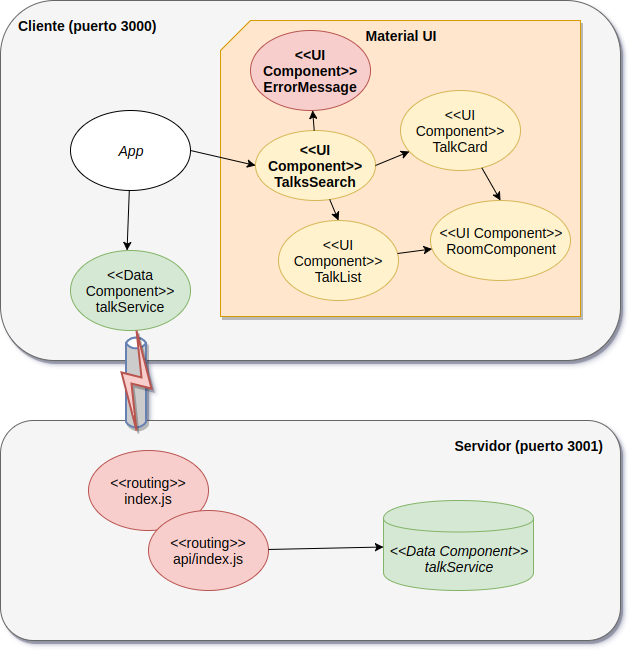

# Curso Full Stack Developer

## Quinta iteración: manejo de errores

Si nosotros detenemos el proyecto NodeJS que corresponde al servidor, la aplicación ReactJS no muestra ningún mensaje de error: simplemente cualquier búsqueda no devuelve resultados. Esto puede resultar contraproducente para el usuario, vamos a incorporar el manejo básico de errores en la comunicación entre cliente y servidor. 

## Diagrama de arquitectura



Tenemos los siguientes cambios:

- hay un nuevo componente ReactJS para mostrar errores (basado en el componente [SnackBar](http://www.material-ui.com/#/components/snackbar) de Material UI)
- cuando disparamos la búsqueda desde el cliente hacia el server, usamos el mensaje _fetch_ que lamentablemente no maneja los errores de http distintos de 200 (OK), entonces debemos hacer esto nosotros manualmente. A futuro podríamos generar una nueva abstracción para no tener que agregar el if en cada componente que dependa de una llamada asincrónica.
- si la respuesta devuelve un código de error (!response.ok) forzamos un error para entrar en el último bloque catch de las promises (nunca llegamos a actualizar el estado de las charlas)

```javascript
    searchTalks(e) {
        const searchValue = e.target.value
        talksService.filter(searchValue)
            .then(response => {
                if (response.ok) {
                    return response.json() 
                } else { 
                    throw Error(response.status + " (" + response.statusText + ")")
                }
            })
            .then(...)
            .catch((err) => {
                this.setState({ 
                    searchValue: searchValue ,
                    talks: [],
                    errorMessage: "No se pudo obtener las charlas. Error: " + err.message
                })
            })
```

## Demo

En la demo vemos cómo responde la aplicación cuando la URL cambió (error 404: Not Found) el server está caído (error 500: Internal Server Error)


