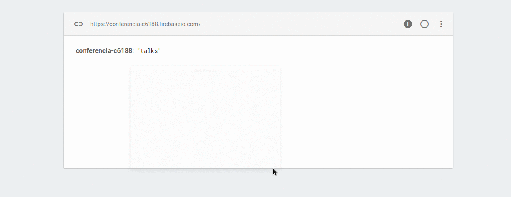
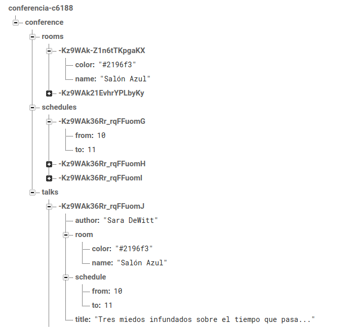
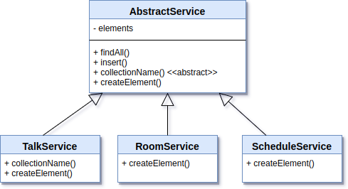
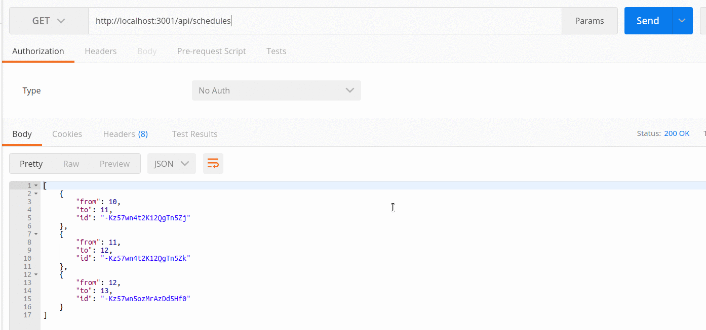
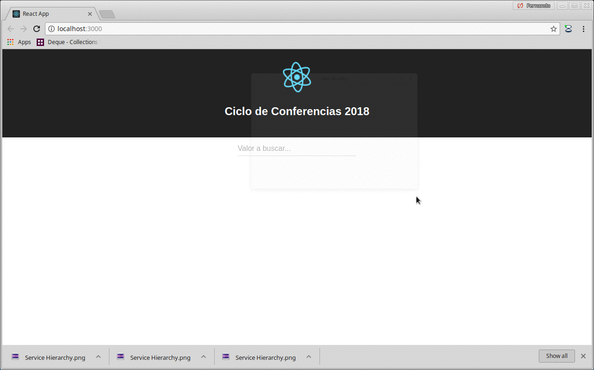
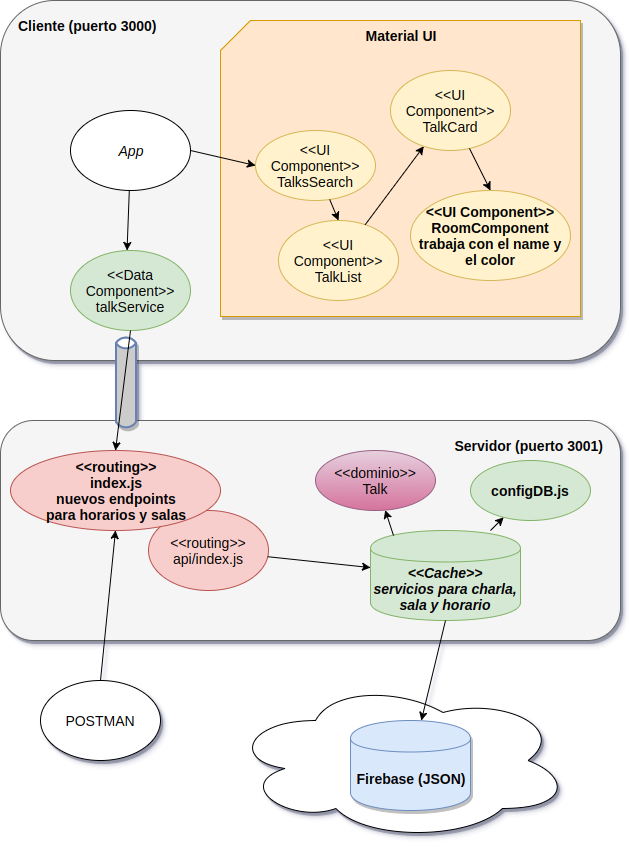

# Curso Full Stack Developer

## Octava iteración: grilla de horarios - Parte I

## "Esto a mí no me sirve"

El usuario ve la aplicación y nos recibe con su tan trillada frase: "Pero ¿y cómo veo yo los horarios de las charlas y las salas en una grilla?"

Ups, bueno, todos nos equivocamos. :smile: 

"Igual está lindo", nos dice guiñándonos un ojo. Bueno, tenemos trabajo.

## Cambios en el modelo

Nos pidieron "una grilla" con el horario, donde no se habla de grilla como control sino como concepto del negocio. Para eso tenemos que incorporar algo que hasta el momento no habíamos considerado: el horario, y tenemos que pensar en ubicar cada charla dentro de una fila / columna. 

Podemos tener como columnas las salas y como filas los horarios. 

### Atributos de calidad de nuestro diseño

Ahora hay que tomar otra decisión: ¿cómo modelar un horario? y ¿necesitamos generar la sala como abstracción? Otra pregunta que aparece es "¿todas las charlas tienen la misma duración?", pregunta que no podemos contestar nosotros, sino **el usuario**, quien nos contesta "en principio sí, eso por ahora no me interesa". Esto da pie para numerosos comentarios: no creerle al usuario, hacerlo flexible de entrada tiene un costo y eso implica resignar otras cosas que el usuario valoraría más. Como además no es sencillo mostrar una grilla considerando horarios diferentes, vamos a elegir simplificar nuestro modelo y decir que todas las charlas tienen la misma duración, por lo tanto cada charla tiene un único horario asignado.

Es decir, poniendo en la balanza muchos atributos de calidad de nuestro diseño elegimos

- simplicidad
- velocidad de construcción

por sobre la 

- flexibilidad
- mantenibilidad

### Horarios

El horario vamos a mantenerlo como:

- una entidad separada (una colección más en Firebase), para facilitar la construcción de la grilla sin tener que recorrer las charlas
- pero también vamos a embeber el valor dentro de la charla, porque también evita tener que hacer JOINs para obtener el dato del horario de una charla particular.  

### Salones

Lo mismo haremos con los salones. Tendremos:

- una entidad separada para facilitar la construcción de las columnas
- y vamos a embeber los datos del salón en cada charla

## Primer paso: definir el nuevo modelo de datos

En Firebase tendremos una colección nueva: conference, que reemplaza a talks. Esto requiere borrar los datos existentes (ya que es más simple que pensar un proceso de migración de datos). 



Para pedir una colección al objeto db, ¡estamos inicializando la aplicación _n_ veces! Debemos cambiar eso ahora que vamos a tener dentro de conference tres colecciones hijas: 

- **talks**: las charlas
- **rooms**: las salas
- **schedules**: los horarios

```javascript
const database = firebase.initializeApp(config).database() 

const db = {
    
    collection(collection) {
        return database.ref(collection)
    }
}
```

Y ahora sí podemos generar nuestro nuevo [initData](server/src/services/initData.js)

```bash
$ node dist/services/initData.js
Data initialization started
. etc.
```

que generará las tres colecciones:



## Repos más generales

En el server, ahora necesitamos tener tres services: uno para las charlas, otro para las salas y finalmente uno más para los horarios. Todos tienen un comportamiento parecido: deben sincronizar la información contra una colección de firebase, mantienen una cache en memoria sincronizada y saben generar un elemento nuevo y buscar todos los elementos de la cache.

Entonces podemos construir un service general, y construir _template method_ para que cada subclase implemente cierto comportamiento:



```javascript
export class AbstractService {

    constructor() {
        this.elements = []
        this.db = db.collection(this.collectionName())
        this.db.on("value", snap => {
            this.elements = []
            snap.forEach(snapshot => {
                const element = this.createElement(snapshot.val())
                element.id = snapshot.key
                this.elements.push(element)
            })
        })
    }

    // por defecto los elementos son json
    createElement(json) {
        return json
    }

    findAll() {
        return this.elements
    }

    insert(elementJSON) {
        const element = new Talk(elementJSON)
        element.validate()
        if (element.ok) {
            this.db.push(element)
        }
        return element
    }

}

export class TalkService extends AbstractService {

    collectionName() {
        return "conference/talks"
    }

    // aquí estamos creando un objeto de dominio JSON
    createElement(json) {
        return new Talk(json)
    }

    filter(value) {
        return this.elements.filter(talk => talk.author.toUpperCase().includes(value.toUpperCase()) || talk.title.toUpperCase().includes(value.toUpperCase()))
    }

}

export class RoomService extends AbstractService {

    collectionName() {
        return "conference/rooms"
    }

}

export class ScheduleService extends AbstractService {

    collectionName() {
        return "conference/schedules"
    }

}
```

## Nuevos endpoints

Para probar nuestros nuevos endpoints modificamos el archivo api/index.js:

```javascript
...
import { TalkService, RoomService, ScheduleService } from "../services/talkService"

const talkService = new TalkService()
const roomService = new RoomService()
const scheduleService = new ScheduleService()
...

export default ({ config, db }) => {
    ...

	api.get('/rooms', (req, res) => {
		res.json(roomService.findAll())
	})

	api.get('/schedules', (req, res) => {
		res.json(scheduleService.findAll())
	})

```

## Prueba en POSTMAN

Probamos los nuevos endpoints en POSTMAN:



## Cambios en el cliente

Si bien nuestro modelo cambió, esto impacta únicamente en el componente que muestra la charla. Lo que vamos a hacer es aprovechar que la sala tiene un color para utilizarlo como fondo, y le vamos a poner un avatar en color negro con letra blanca, para que sea lo suficientemente neutro:

```javascript
export class RoomComponent extends Component {
    render() {
        return (
            <Chip
            backgroundColor={this.props.room.color}
            >
                <Avatar color={white} backgroundColor={darkBlack}>
                    ?
                </Avatar>
                { this.props.room.name  }
            </Chip>
        )
    }
}
```

## Demo de esta iteración

La aplicación en React tiene ese pequeño cambio:



## Diagrama de arquitectura




