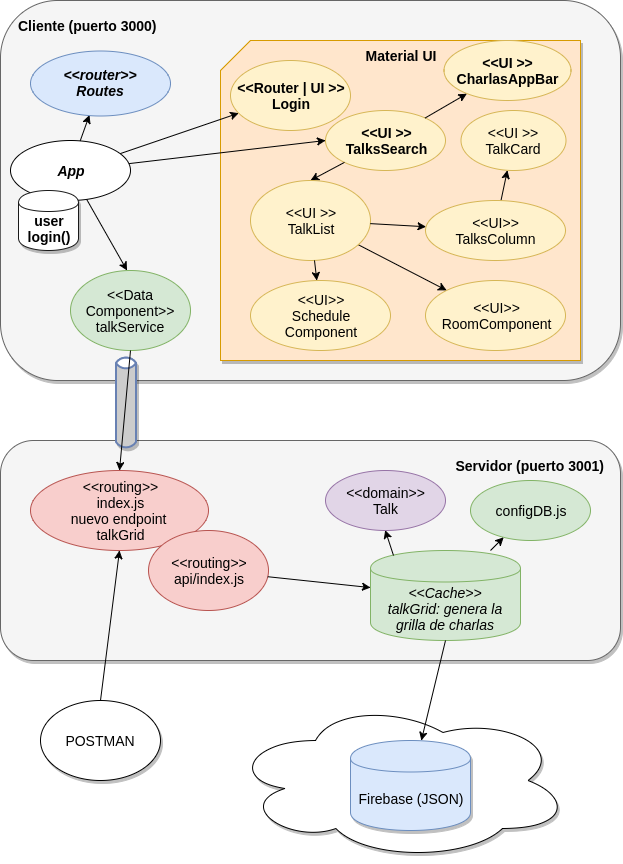

# Curso Full Stack Developer

## 13° iteración: login

En esta iteración

- queremos que al loguearse el usuario esto tenga algún efecto. Pero ese efecto debería trascender la propia página de login, entonces vamos a ubicar el usuario como parte del estado de nuestra aplicación. Por lo tanto habrá que pasar el usuario en la definición de la ruta y los componentes "hijos" de App. 
- mostraremos los datos del usuario logueado en la AppBar. Mientras no se haya logueado nadie, quedará como usuario "anónimo" y una vez logueado mostrará un avatar con la inicial y el nombre del usuario. No tenemos validaciones para ingresar al sistema.
- Además queremos que cuando el usuario ingrese al sistema se redirija automáticamente a la grilla de charlas. 

## Demo de esta iteración

Vemos cómo queda la aplicación en ReactJS:


## Diagrama de arquitectura



## Explicación del login

En el archivo App.js definimos el usuario en el estado:

```javascript
  state = {
      user: ''
  }
```

y la función de Login, que modifica el estado de nuestra aplicación:

```javascript
  login = (user) => {
    this.setState({ user: user })
    console.log("El usuario " + user + " ingreso al sistema")
  }
```

Para poder publicar esa función, debemos exponerla en un mapa de props:

```javascript
  render() {
    const childProps = {
      user: this.state.user,
      login: this.login
    }
```

En la definición del routing (archivo routes.js), reemplazamos la propiedad _component_ por un _render_ específico donde pasamos los childProps, aprovechando [algunos consejos](https://stackoverflow.com/questions/41679324/how-do-i-pass-parent-state-to-its-child-components):

```javascript
  <Router>
      <Switch>
          <Route exact path='/' render={() => <TalksSearch childProps={this.props.childProps} />} />
          <Route exact path='/login' render={() => <Login childProps={this.props.childProps} />} />
      </Switch>
  </Router>
```

Fíjense que al Route ya no le definimos el componente sino la propiedad render, que es una función que no tiene parámetros y devuelve el componente correspondiente.

En el login, recibimos como childProps la función y tenemos nuestra propia función login que

- delega a la función login de App.js
- pero además maneja la navegación hacia nuestro home, a partir de la variable history.

```javascript
class Login extends Component {

    ...

    login() {
        this.props.childProps.login(this.state.username)
        this.props.history.push('/')
    }
```

Para poder usar la referencia **history**, debemos envolver nuestro componente Login en el **HOC (Higher-Order Component) withRouter**, que se encarga de inyectarle el historial de navegación. 

```javascript
export default withRouter(Login)
```

## Avatar del usuario

Para incorporar el avatar del usuario, definimos un nuevo componente CharlasAppBar que reemplaza a la AppBar de React con Material UI. Este componente recibe

- el título que corresponde a un caso de uso (title)
- el nombre de usuario (username)

```javascript
class CharlasAppBar extends Component {

    render() {
        const initial = (this.props.username || ' ').substr(0, 1).toUpperCase()

        const chipUser = (this.props.username) ? 
                <Chip style={{ margin: 'auto' }}>
                    <Avatar size={32}>{initial}</Avatar>
                    {this.props.username}
                </Chip>
                :
                <Chip style={{ margin: 'auto' }}>
                    <Avatar color="#444" icon={<SvgIconFace />} />
                    Usuario anónimo
                </Chip>
            
        return (
            <AppBar
                title={this.props.title}
            >
            {chipUser}
            </AppBar>
        )
    }
}
```

La referencia const chipUser se completa con un Chip de usuario anónimo (que utiliza un gráfico) o bien con el nombre del usuario, en cuyo caso se toma la inicial en mayúsculas (el operador || permite manejar los nulos en forma menos burocrática que con un if).

Para pasarle la información, tanto el login como el talkSearch le pasan el título y el usuario (este último lo reciben del App):

```javascript
  <CharlasAppBar
      title="Login"
      username={this.props.user}
  />
```
_login.js_

```javascript
  <CharlasAppBar
      title="Grilla de charlas"
      username={this.props.childProps.user}
  />
```
_talksSearch.js_

