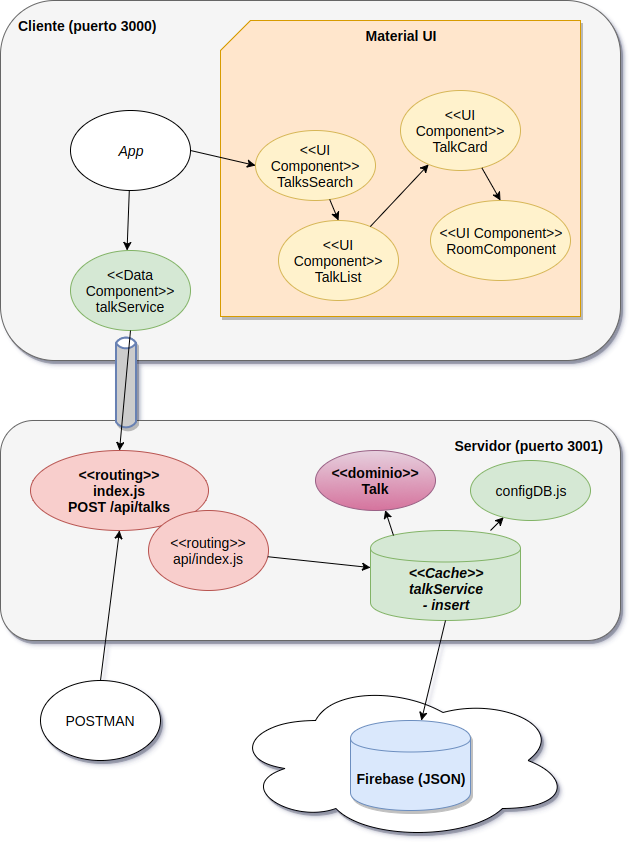
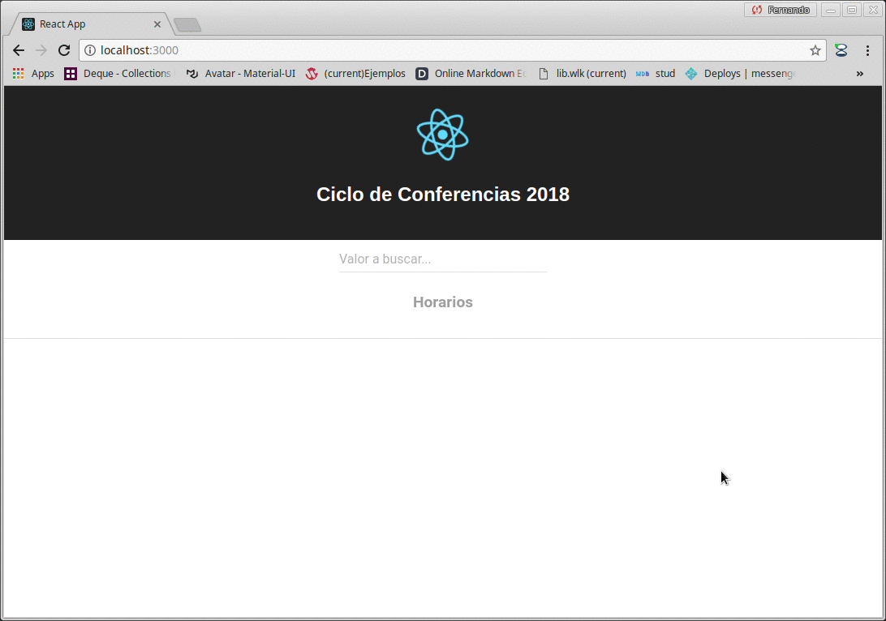

# Curso Full Stack Developer

## Séptima iteración: alta de una charla mediante un servicio REST

## Node monitor

Empezamos a utilizar [nodemon](https://nodemon.io/), que es una utilidad que nos permite que el server node se reinicie automáticamente cada vez que hacemos un cambio sobre los archivos que están alojados en el server. En el archivo _package.json_ lo configuramos reemplazando el script _start_ para utilizar nodemon en lugar de node:

```json
  "scripts": {
    "dev": "nodemon -w src --exec \"babel-node src --presets es2015,stage-0\"",
    "build": "babel src -s -D -d dist --presets es2015,stage-0",
    "start": "nodemon dist",
    ...
```

## Diagrama de arquitectura



En el lado cliente no hay modificaciones. 

Del lado del server tenemos algunos cambios: 

- talksService ahora permite dar de alta una charla, para lo cual queremos agregar validaciones: deben ingresarse título, autor y sala donde se realiza la conferencia. Esto nos lleva a modelar un objeto de dominio que llamamos Talk, que sabe validarse, si está ok la validación (una propiedad de lectura) y completar su información en base a un JSON. 

```javascript
export default class Talk {

    ...

    validate() {
        if (this.title == "") {
            this.errors.push("Debe ingresar título")
        }
        if (this.author == "") {
            this.errors.push("Debe ingresar autor")
        }
        if (this.room == "") {
            this.errors.push("Debe ingresar sala")
        }
    }

    get ok() {
        return this.errors.length == 0
    }

    fromJSON(talkJSON) {
        this.author = talkJSON.author
        this.title = talkJSON.title
        this.room = talkJSON.room
    }
} 
```

La aparición del objeto Talk simplifica la sincronización con Firebase (se minimiza la cantidad de líneas).

```javascript
export default class TalksService {
    
        constructor() {
            this.talks = []
            this.db = db.collection("talks")
            this.db.on("value", snap => {
                this.talks = []
                snap.forEach(snapTalk => {
                    const talk = new Talk(snapTalk.val())
                    talk.id = snapTalk.key
                    this.talks.push(talk)
                })
            })
        }

        insert(talkJSON) {
            const talk = new Talk(talkJSON)
            talk.validate()
            if (talk.ok) {
                this.db.push(talk)
            }
            return talk
        }
```

- a su vez, aparece un nuevo endpoint: un método POST a la URL /api/talks donde recibimos en el body un JSON. El procesamiento en sí lo delegamos a talkService, pero además devolvemos un JSON con la respuesta (se dio de alta ok o se produjeron los siguientes errores)

## Prueba desde un cliente REST

En nuestro caso utilizamos [Postman](https://chrome.google.com/webstore/detail/postman/fhbjgbiflinjbdggehcddcbncdddomop), pero pueden usar Advanced REST Client o cualquier otra aplicación que dispare pedidos REST hacia nuestro server node. Es importante respetar:

- el método debe ser POST
- la URL http://localhost:3001/api/talks
- en el BODY deben configurar el content-type como JSON (de otra manera no va a reconocerlo el body-parser que es el componente en node) y escribir el JSON con los valores para title, author y room

## Demo

En la demo vemos cómo al disparar la actualización desde Postman nos aparece mensajes de error o un ok y se visualiza en la aplicación React así como en Firebase:



