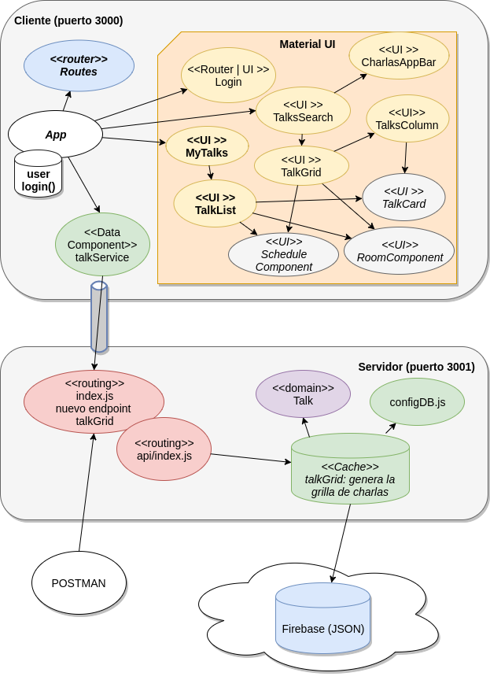

# Curso Full Stack Developer

## 14° iteración: caso de uso "Mis charlas"

Nuestra intención es mostrar cómo podemos reutilizar componentes de ReactJS. Para eso el caso de uso "Mis charlas" mostrará las charlas que coincidan con el usuario logueado (para esta versión no nos interesa ser muy estrictos, basta con que esté incluido el nombre en el título o el expositor). Para ello aprovecharemos los componentes que muestran una charla, un horario y una sala.


## Demo de esta iteración

Vemos cómo queda la aplicación en ReactJS:


## Menú de opciones nuevo

El componente CharlasAppBar ahora muestra un menú de opciones. 

- en el caso de estar logueado el usuario, debe mostrar el link a "Mis charlas"
- en el caso de no estar logueado, debe mostrar el link a "Login"
- en cualquiera de los otros casos, debe mostrar el link al home "Grilla de charlas"

Todo esto debe ocurrir siempre y cuando no estemos ya en el caso de uso, para lo cual pasaremos al componente la propiedad _page_.

Para evitar repetición de código, generamos una función específica que sabe mostrar un RaisedButton (el botón que permite ir hacia otro caso de uso) dependiendo de que no sea la página en la que ya estamos, y también de una condición que pasamos como parámetro (llamada _menuCondition_). Esta condición es un _closure_, una porción de código que se pasa como una función y que se aplica para devolver (o no) el link.

```jsx
class CharlasAppBar extends Component {

    buildMenu(pageName, label, url, menuCondition) {
        if (this.props.page !== pageName && menuCondition()) {
            return <RaisedButton label={label} style={{ margin: 'auto' }} onClick={() => this.props.history.push(url)} default={true} />
        }
    }

    render() {
        ...

        return (
            <AppBar
                title={this.props.title}
            >
                {chipUser}
                &nbsp;&nbsp;
                {this.buildMenu('login', 'Login', '/login', () => !this.props.username)}
                {this.buildMenu('misCharlas', 'Mis charlas', '/misCharlas', () => this.props.username)}
                {this.buildMenu('grilla', 'Grilla', '/', () => true)}
            </AppBar>
        )
```

## Caso de uso Grilla de Charlas

El componente que implementa la grilla de charlas se renombró a TalksGrid.

## Caso de uso Mis charlas

Creamos un nuevo componente MyTalks, que muestra la barra con el menú, dispara la búsqueda pasándole el usuario logueado y luego se lo pasa a otro componente nuevo: TalksList.


## Lista de Mis Charlas

La lista de "mis charlas" o TalksList recibe una lista de charlas (plana, no nos interesa aquí trabajarla como grilla) y muestra los elementos separándolos en dos columnas

- a la izquierda, la sala y el horario (llamando a los componentes Room y Schedule, que ya está desarrollado)
- a la derecha, la charla (llamando al componente TalkCard, que ya está desarrollado)

```javascript
export default class TalksList extends Component {

    render() {
        return (
            <Table>
                <TableHeader displaySelectAll={false} adjustForCheckbox={false} className="header">
                    <TableRow key="header" displayBorder={false}>
                        <TableHeaderColumn key="charla" width="100%">
                            <div align="center">
                                <h2 className="header">Charla</h2>
                            </div>
                        </TableHeaderColumn>
                    </TableRow>
                </TableHeader>
                <TableBody displayRowCheckbox={false}>
                    {this.props.talks.map((talkDTO, index) =>
                        <TableRow key={index} displayBorder={false} className="row">
                            <TableRowColumn width="10%">
                                    <RoomComponent room={talkDTO.room} key={talkDTO.room.name} />
                                    <br/>
                                    <ScheduleComponent schedule={talkDTO.schedule} key={talkDTO.schedule.from} />
                            </TableRowColumn>
                            <TableRowColumn width="90%">
                                <TalkCard talk={talkDTO} key={index} />
                            </TableRowColumn>
                        </TableRow>
                    )
                    }
                </TableBody>
            </Table>
        )
    }

}
```

De esa manera rápidamente pudimos crear un nuevo caso de uso en base a componentes existentes.


## Trabajo futuro

Tanto el login como el menú de opciones puede mejorarse. En particular recomendamos investigar [Passport](http://www.passportjs.org/), un middleware que permite autenticación contra Facebook, Google, LinkedIn, etc. del lado del server. 


## Diagrama de arquitectura




