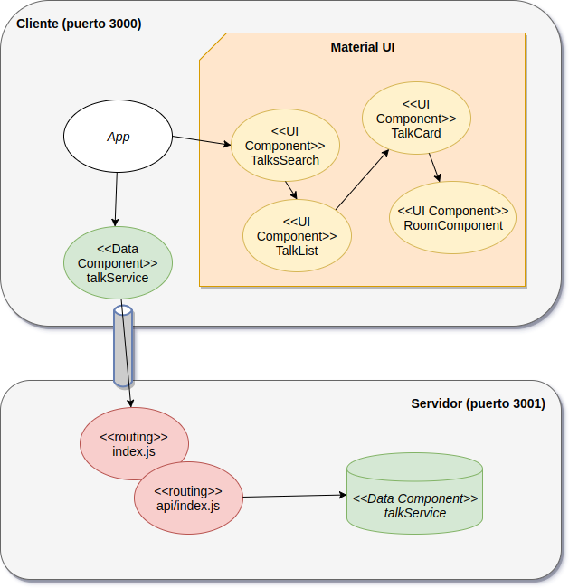

# Curso Full Stack Developer

## Cuarta iteración: agregando el application server Node

En esta iteración agregaremos un application server en ES6 llamado **NodeJS**, que hasta ahora habíamos utilizado para descargar dependencias y construir el proyecto ReactJS (mediante el node package manager o _npm_).

## Tareas de un application server

- Provee un ambiente donde corran las aplicaciones. Este ambiente quizás ya lo conozcan: es una Virtual Machine de Javascript
- Escucha pedidos en un puerto y responde a esos pedidos. Podemos enviar pedidos GET, POST, PUT y DELETE según la terminología REST, y nos devuelve diferentes tipos de respuesta: por lo general JSON, pero también HTML o cualquier otro formato que un navegador entienda.
- Por lo general provee algún mecanismo para convertir una ruta o _URL_ en código que un objeto (en este caso Javascript) pueda responder
- Nosotros vamos a implementar esa respuesta

## Primeros pasos con NodeJS

Para tener un servidor NodeJS en un proyecto desde cero basta con crear un directorio vacío y luego ejecutar

```bash
$ cd directorioDelProyecto
$ npm init
$ sudo npm install -g nodejs express body-parser --save
```

Te dejamos [un tutorial muuuy tranquilo para que practiques en tu casa](https://www.youtube.com/watch?v=U8XF6AFGqlc)

También tenés [este proyecto](https://github.com/babel/example-node-server) para armar un proyecto siguiendo tus propios pasos.

# La nueva arquitectura

A partir de esta iteración tendremos dos proyectos diferentes:

- el **Front End**, nuestro proyecto conocido hasta ahora, ubicado en el directorio _client_ y que contiene la parte de presentación (o interfaz de usuario) hecha en ReactJS
- el **Back End**, que constituye una capa de servicios que se acceden mediante una URL y se ubica en el directorio _server_

Cada uno de estos proyectos correrá en una VM separada, en este caso ambas coinciden y son ambientes de objetos javascript provistos por NodeJS:




En el FrontEnd tenemos un cambio importante:

- el **TalkService** ya no tiene la información de las charlas, sino que cada vez que buscamos dispara un pedido hacia el servidor, donde finalmente se trae la lista de charlas en formato JSON. Este pedido no es sincrónico, sino que se lanza como una **promise** o pedido asincrónico que requiere dos pasos hasta finalmente obtener el resultado.
- Como consecuencia de esto el componente **TalkSearch** necesita esperar para cambiar su estado (_state_) ya que ahora hay dos momentos: 1) el usuario escribe algo en el campo de búsqueda y se pide al server la información de las charlas posibles, 2) la información pedida llega al nodo cliente y React está listo para volver a renderizar la grilla.


Lamentablemente, no todos los proyectos tienen todo lo que necesitamos. En este caso la dependencia _resource-router-middleware_ es un tanto estricta y no permite pasarle un valor a buscar en lugar de un id de un elemento existente (en nuestro caso una charla). Tampoco queremos trabajar con un middleware, por lo tanto simplificamos un poco las definiciones y eliminamos los punto y coma innecesarios :smile:.

## Servidor Node

https://github.com/developit/express-es6-rest-api

## Demo


## Diagrama de la arquitectura


